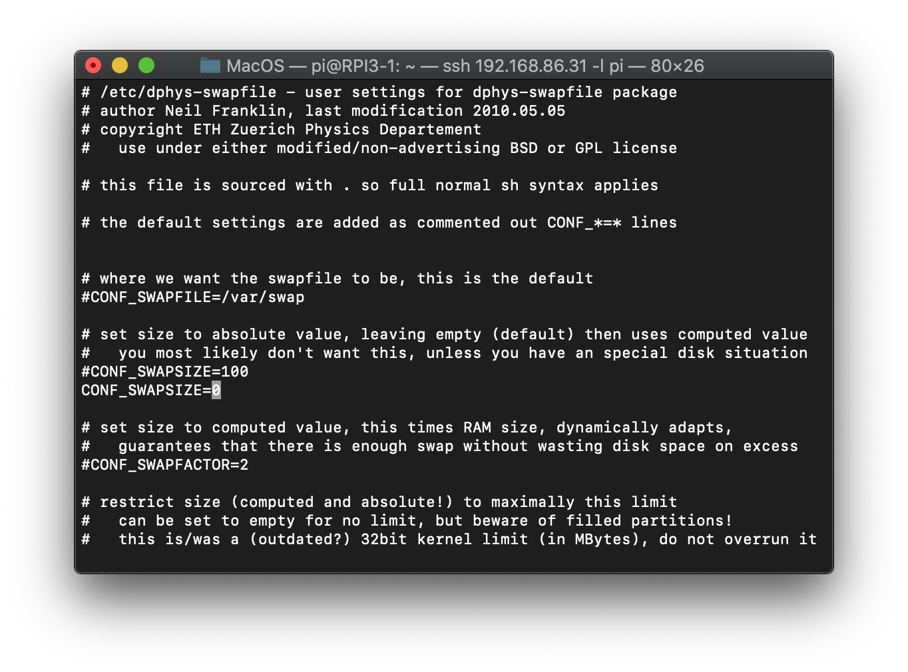
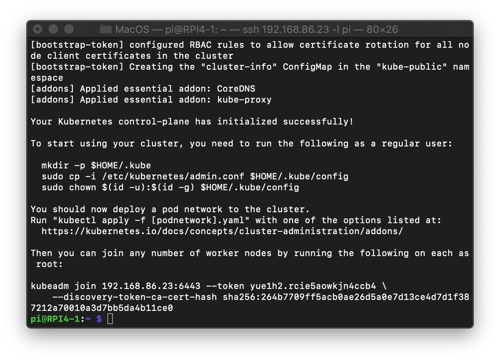
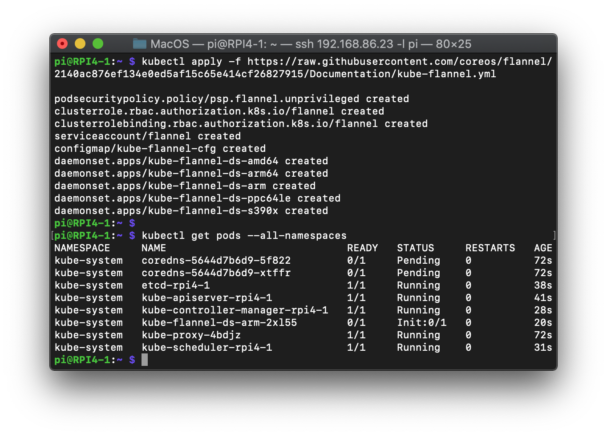
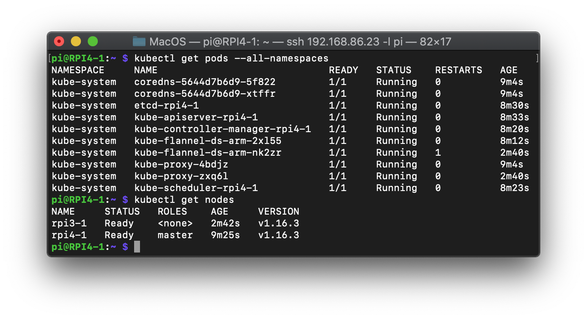

# Setting Kubernetes on RPI 4

## 0. Setup RPI

- Install Raspbian-buster-lite
- Setup WIFI network and ssh
- Install Docker
- Change host name from raspberrypi using `sudo vi /etc/hostname` and `sudo vi /etc/hosts`
- Reboot RPI

## 1. Ensure iptables tooling does not use the nftables backend

In Linux, nftables is available as a modern replacement for the kernel’s iptables subsystem. This nftables backend is not compatible with the current kubeadm packages

~~~sh
sudo update-alternatives --set iptables /usr/sbin/iptables-legacy
sudo update-alternatives --set ip6tables /usr/sbin/ip6tables-legacy
~~~

## 2. Swap Off

You MUST disable swap in order for the kubelet to work properly

~~~sh
sudo dphys-swapfile swapoff && \
sudo dphys-swapfile uninstall && \
sudo update-rc.d dphys-swapfile remove
~~~

Set CONF_SWAPSIZE=0 in `etc/dphys-swapfile`

~~~sh
sudo vi /etc/dphys-swapfile
~~~

Reboot RPI and check swap off by using `sudo swapon --summary` and the response is empty

## 3. Install kubeadm, kubelet, kubectl

~~~ sh
sudo apt-get update && sudo apt-get install -y apt-transport-https curl
curl -s https://packages.cloud.google.com/apt/doc/apt-key.gpg | sudo apt-key add -
cat <<EOF | sudo tee /etc/apt/sources.list.d/kubernetes.list
deb https://apt.kubernetes.io/ kubernetes-xenial main
EOF
sudo apt-get update
sudo apt-get install -y kubelet kubeadm kubectl
sudo apt-mark hold kubelet kubeadm kubectl
~~~

## 4. Setup master node

To initialize the control-plane node run:

~~~sh
# For install flannel --pod-network-cidr=10.244.0.0/16 argument is required
sudo kubeadm init --pod-network-cidr=10.244.0.0/16
~~~

To make kubectl work for your non-root user, run these commands, which are also part of the kubeadm init output:

~~~sh
mkdir -p $HOME/.kube
sudo cp -i /etc/kubernetes/admin.conf $HOME/.kube/config
sudo chown $(id -u):$(id -g) $HOME/.kube/config
~~~

Install Flannel

Set /proc/sys/net/bridge/bridge-nf-call-iptables to 1 by running sysctl net.bridge.bridge-nf-call-iptables=1 to pass bridged IPv4 traffic to iptables’ chains. This is a requirement for some CNI plugins to work

~~~sh
sudo sysctl net.bridge.bridge-nf-call-iptables=1
~~~

~~~sh
kubectl apply -f https://raw.githubusercontent.com/coreos/flannel/2140ac876ef134e0ed5af15c65e414cf26827915/Documentation/kube-flannel.yml
~~~

Check pods `kubectl get pods --all-namespaces`

## For worker node

Joining your nodes

~~~sh
sudo kubeadm join 192.168.86.23:6443 --token j0j9t5.6x5qdrwfd04t055f \
    --discovery-token-ca-cert-hash sha256:74fb477b591d7cf6b9039ad8e2934a9ba9eba8e15b109c617b7d8d0137f5e3a7
~~~

Check worker node in master node `kubectl get nodes`

## References

<https://medium.com/nycdev/k8s-on-pi-9cc14843d43>

<https://kubernetes.io/docs/setup/production-environment/tools/kubeadm/install-kubeadm/>

<https://kubernetes.io/docs/setup/production-environment/tools/kubeadm/create-cluster-kubeadm/#>